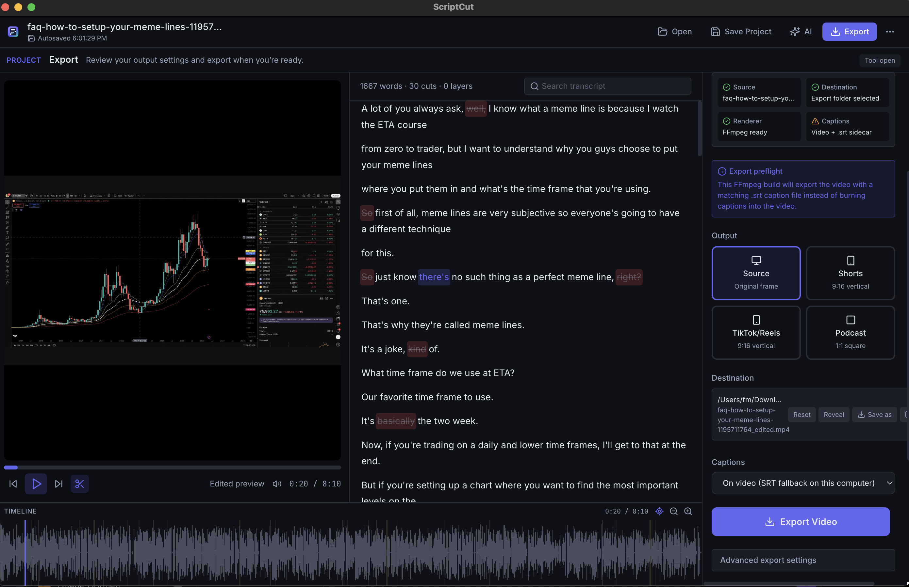

# ScriptCut

<p align="center">
  
</p>

> Edit spoken video like a document. Turn long recordings into finished videos and social-ready clips.

ScriptCut is an open-source, local-first desktop video production tool for YouTube creators, podcasters, educators, founders, interview creators, streamers, and anyone repurposing spoken recordings.

## Download ScriptCut

<p>
  <a href="https://github.com/FernandoAbishai/ScriptCut/releases/download/v0.1.0-alpha.5/ScriptCut-v0.1.0-alpha.5-arm64.dmg"></a>
  <a href="https://github.com/FernandoAbishai/ScriptCut/releases/tag/v0.1.0-alpha.5">Release notes &amp; verification</a>
</p>

**v0.1.0-alpha.5 · macOS Apple Silicon / arm64 · Public alpha · ad-hoc signed · not notarized**

No Terminal setup is required for the supported packaged app. This public download is for Apple Silicon Macs; it is not a universal macOS, Windows, or Linux installer, and it is not signed with Apple Developer ID or notarized.
For future beta runs, use the official [GitHub Releases feed](https://github.com/FernandoAbishai/ScriptCut/releases) as the release authority and record the exact tag.

## Install in 3 steps

1. Download the official DMG above.
2. Open it and move **ScriptCut** to **Applications**.
3. Launch **ScriptCut** from Applications.

If macOS blocks the first launch, open **System Settings → Privacy & Security → Open Anyway**, then confirm the prompt. Use this only for the official ScriptCut download linked above. Do not disable Gatekeeper or run Terminal quarantine commands.

For a short, non-technical walkthrough, read the [First Export Guide](docs/FIRST_EXPORT.md).

For the external beta contract, qualification record, and focused feedback path, see [External Beta](docs/EXTERNAL_BETA.md), [Beta Qualification](docs/BETA_QUALIFICATION.md), and [Beta feedback / bug report](https://github.com/FernandoAbishai/ScriptCut/issues/new?template=beta_feedback.yml).

## What to expect on first use

The supported self-contained public-alpha path includes the application runtime, Python runtime, core dependencies, FFmpeg, and FFprobe. No separate Python or FFmpeg setup is required for this packaged release. Older alpha releases may predate this self-contained path; check their release notes before downloading an older build.

Before the first transcription, ScriptCut downloads and verifies the baseline transcription model. Later baseline transcriptions can reuse that verified local model. An AI provider is not required for core transcript editing or export.

## What ScriptCut does

ScriptCut is different from a cloud-first editor because local processing is the baseline path, AI helpers are optional, and project files stay creator-owned. Choose a recording, edit the words, review the result, and export a finished video or clip.

See [the Product Vision](docs/PRODUCT_VISION.md) for the canonical product direction.



## The two primary workflows

### Edit a Video

**Edit spoken video by editing the transcript.** Open a local video or audio file, edit the transcript, preview the result, and export. You can delete, restore, mute, or hide selected words from captions. AI edit plans and filler-word suggestions are reviewable helpers; they do not replace your decisions.

See [docs/USER_GUIDE.md](docs/USER_GUIDE.md) for the detailed creator walkthrough.

### Create Clips

**Find, review and export social-ready moments.** The current lifecycle is **Find → Review → Prepare → Export**. Find moments with AI when a provider is configured, or select transcript words yourself and choose **Draft clip**; manual clips can move directly into **Prepare**.

In **Prepare**, trim the range, preview the clip, adjust framing/reframe, and choose captions. **Advanced export settings** such as resolution, format, enhance audio, and background removal are secondary controls. **Publishing copy is optional** and is not required to export. A successful export shows a creator-facing **Clip ready** result; when burn-in captions are unavailable, captions can be delivered as a matching `.srt` sidecar.

## What works today

- Word-level transcription through Parakeet TDT v3, WhisperX, or Whisper when the selected local engine is installed.
- Transcript-based editing with edited playback, undo/redo, waveform/timeline synchronization, and speaker-aware operations when speaker labels are available.
- AI-assisted edit plans, filler-word detection with review decisions, clip suggestions, editable clip drafts, clip readiness scoring, and generated clip metadata.
- Source, vertical, and square exports with creator presets, reframe controls, optional Studio Sound audio cleanup, and optional background removal.
- Word-level captions with caption styling. Depending on the FFmpeg build, captions are burned into the video or delivered as a matching `.srt` sidecar file; the export preflight shows the actual result.
- Approved-clip batch export with per-draft progress, retry state, and a batch manifest in the desktop workflow.
- `.scriptcut` project save/load, recent projects, autosave, recovery snapshots, and compatibility with legacy `.aive` and `.cutscript` files.

Some capabilities depend on optional local packages, model downloads, provider configuration, or the capabilities of the packaged FFmpeg build. The setup assistant and export preflight are the source of truth for a particular machine.

## Local-first and AI behavior

The desktop app runs an Electron shell with a local React interface, a local FastAPI backend, and FFmpeg for media work. Transcription and export use local tools by default where available.

AI features can use local Ollama or configured OpenAI, Claude, or 9Router providers. Selecting an external provider can send the requested transcript or prompt context to that provider. ScriptCut does not require AI for core transcript editing or export, and this README does not make a blanket privacy claim beyond the configured workflow.

See [Platform Support](docs/PLATFORM_SUPPORT.md) for the support matrix. Browser mode at `localhost:5173` is for development and testing; use the desktop app for native file access, persistent export folders, autosave, and Finder reveal actions.

## For developers and contributors

If a public release asset is not available, ScriptCut can be run from source using the contributor setup below. The complete release process is documented in [docs/RELEASE.md](docs/RELEASE.md).

### Contributor quick start

These steps are for running ScriptCut from the repository.

### Prerequisites

- Node.js 18+
- Python 3.10 to 3.12
- FFmpeg in `PATH` for source development. Desktop release builds include a bundled FFmpeg when prepared with `npm run release:ffmpeg`.
- Optional: Ollama for local AI features

Python 3.11 is recommended on Apple Silicon. Python 3.13 is not supported by the current transcription dependency stack.

### macOS setup

```bash
brew install ffmpeg
python3.11 -m venv .venv
source .venv/bin/activate
```

To force a specific interpreter:

```bash
export SCRIPTCUT_PYTHON_PATH=/absolute/path/to/python
```

`CUTSCRIPT_PYTHON_PATH` is still supported for legacy setups, but `SCRIPTCUT_PYTHON_PATH` is preferred.

### Install and run

```bash
npm run setup
npm run doctor
npm run dev
```

This starts the local backend, Vite frontend, and Electron desktop app together. For local desktop packaging, run:

```bash
npm run dist:mac
```

That creates a macOS DMG under `dist/`. See [docs/INSTALL.md](docs/INSTALL.md), [docs/DEVELOPMENT.md](docs/DEVELOPMENT.md), and [CONTRIBUTING.md](CONTRIBUTING.md) for technical setup and contribution guidance.

To verify the backend separately:

```bash
npm run dev:backend
curl -s http://127.0.0.1:8642/health
```

Expected response:

```json
{"status":"ok"}
```

## Project structure and technical reference

```text
scriptcut/
├── electron/   # desktop shell, IPC, and local backend lifecycle
├── frontend/   # React/Vite creator interface
├── backend/    # FastAPI transcription, AI, caption, audio, and export services
└── shared/     # project schema and shared contracts
```

The main technical pieces are Electron + React, a local FastAPI backend, Parakeet/WhisperX/Whisper transcription, and FFmpeg export. The local API includes health, transcription, export, job lifecycle, AI helper, caption, audio, and background-capability endpoints. See the backend routers for the current endpoint contract.

Project files are canonical JSON with `schema: "scriptcut.project.v1"` and `version: 1`. Manual saves and autosaves use the same serializer, with compatibility for legacy `.aive` and `.cutscript` files.

### Local API surface

| Method | Endpoint | Description |
|--------|----------|-------------|
| GET | `/health` | Health check |
| POST | `/transcribe` | Transcribe media |
| POST | `/jobs/transcribe` | Start a transcription job |
| POST | `/export` | Export edited video |
| POST | `/jobs/export` | Start an export job |
| GET | `/jobs/{job_id}` | Read job progress, logs, result, or error |
| POST | `/jobs/{job_id}/cancel` | Request job cancellation |
| POST | `/jobs/{job_id}/retry` | Retry a failed or canceled job |
| POST | `/ai/filler-removal` | Detect filler words |
| POST | `/ai/create-clip` | Suggest clips |
| POST | `/ai/clip-metadata` | Suggest title, hook, caption, and hashtags |
| POST | `/ai/edit-plan` | Create a reviewable AI edit plan |
| GET | `/ai/ollama-models` | List local Ollama models |
| POST | `/ai/9router-models` | List models exposed by 9Router |
| POST | `/captions` | Generate captions |
| POST | `/audio/clean` | Noise reduction |
| GET | `/audio/capabilities` | Audio processing availability |
| GET | `/background/capabilities` | Background removal availability |

Long-running jobs use `queued`, `running`, `canceling`, `succeeded`, `failed`, and `canceled` states. A canceled job is retryable after it reaches final `canceled` state.

## Keyboard shortcuts

| Key | Action |
|-----|--------|
| Space | Play / Pause |
| J / K / L | Reverse / Pause / Forward |
| ← / → | Seek ±5 seconds |
| Delete | Delete selected words |
| Ctrl+Z / Cmd+Z | Undo |
| Ctrl+Shift+Z / Cmd+Shift+Z | Redo |
| Ctrl+S / Cmd+S | Save project |
| Ctrl+E / Cmd+E | Export |
| ? | Shortcut cheatsheet |

## Quality checks

For release-oriented changes, run the checks appropriate to the affected area:

```bash
npm run lint
npm run build
npm run smoke:backend
python -m compileall -q backend
```

Use [docs/DESKTOP_QA.md](docs/DESKTOP_QA.md) for the creator workflow checklist and [docs/TROUBLESHOOTING.md](docs/TROUBLESHOOTING.md) when setup or runtime checks fail.

## Contributing

Start with [docs/INSTALL.md](docs/INSTALL.md), [docs/DEVELOPMENT.md](docs/DEVELOPMENT.md), and [CONTRIBUTING.md](CONTRIBUTING.md). Keep changes focused on creator workflows, preserve support for legacy project files, and retain the original CutScript attribution.

## License

ScriptCut is open-source software licensed under the GNU Affero General Public License v3.0 or later (`AGPL-3.0-or-later`).

Portions derived from DataAnts-AI/CutScript retain their original MIT notices. See [THIRD_PARTY_NOTICES.md](THIRD_PARTY_NOTICES.md) and [LICENSES/CutScript-MIT.txt](LICENSES/CutScript-MIT.txt).

Organizations that need different licensing terms can see [COMMERCIAL-LICENSING.md](COMMERCIAL-LICENSING.md).

The software license does not grant rights to ScriptCut branding. See [TRADEMARKS.md](TRADEMARKS.md).

ScriptCut began as a fork and continuation of [DataAnts-AI/CutScript](https://github.com/DataAnts-AI/CutScript). See [ACKNOWLEDGEMENTS.md](ACKNOWLEDGEMENTS.md) for the original-project attribution.
